# MCPortal

[](https://img.shields.io/github/v/release/alohays/mcportal)
[](https://github.com/alohays/mcportal/actions/workflows/main.yml?query=branch%3Amain)
[](https://codecov.io/gh/alohays/mcportal)
[](https://img.shields.io/github/commit-activity/m/alohays/mcportal)
[](https://img.shields.io/github/license/alohays/mcportal)

MCPortal is an open-source bridge between the Model Context Protocol (MCP) and OpenAI's Agents SDK & built-in tools. It enables developers to use OpenAI's powerful tools while staying compliant with the MCP protocol standard.

## 🌟 Features

- **OpenAI Tools as MCP Servers**: Wrap OpenAI built-in tools as MCP-compliant servers
- **Simplified Tracing**: Lightweight tracing implementation inspired by OpenAI's tracing capabilities
- **Visual Debugging**: Web interface for visualizing and debugging agent interactions
- **Easy Integration**: Simple APIs for integrating with existing MCP and OpenAI-based projects

## 🤔 Why MCPortal?

As the AI ecosystem evolves, we're seeing two parallel developments:

1. **OpenAI's Agents SDK & Tools**: Powerful, proprietary tools with excellent tracing and debugging capabilities
2. **Model Context Protocol (MCP)**: An open standard for tool communication with AI models

This creates a dilemma for developers:

```mermaid
graph TD
    subgraph "Developer's Dilemma"
        style Developer fill:#ff9e64,stroke:#fff,stroke-width:2px
        Developer((Developer))
    end

    subgraph "OpenAI's Ecosystem"
        style OpenAITools fill:#bb9af7,stroke:#fff,stroke-width:2px
        style Tracing fill:#bb9af7,stroke:#fff,stroke-width:2px
        style Evaluation fill:#bb9af7,stroke:#fff,stroke-width:2px
        style VendorLock fill:#f7768e,stroke:#fff,stroke-width:2px,stroke-dasharray: 5 5

        OpenAITools["Built-in Tools<br/>(Web Search, Code Interpreter)"]
        Tracing["Advanced Tracing<br/>(Visual Debugging)"]
        Evaluation["Evaluation Dashboards<br/>(Performance Metrics)"]
        VendorLock["Vendor Lock-in<br/>⚠️ Closed Source ⚠️"]

        OpenAITools --> Tracing
        Tracing --> Evaluation
        OpenAITools -.-> VendorLock
        Tracing -.-> VendorLock
        Evaluation -.-> VendorLock
    end

    subgraph "MCP Ecosystem"
        style MCPStandard fill:#7dcfff,stroke:#fff,stroke-width:2px
        style MCPTools fill:#7dcfff,stroke:#fff,stroke-width:2px
        style OpenStandard fill:#9ece6a,stroke:#fff,stroke-width:2px
        style LimitedTools fill:#f7768e,stroke:#fff,stroke-width:2px,stroke-dasharray: 5 5

        MCPStandard["Model Context Protocol<br/>(Open Standard)"]
        MCPTools["MCP-compatible Tools"]
        OpenStandard["Open Ecosystem<br/>✅ Interoperability ✅"]
        LimitedTools["Limited Tool Quality<br/>⚠️ Less Mature (e.g., web search, computer use) ⚠️"]

        MCPStandard --> MCPTools
        MCPStandard --> OpenStandard
        MCPTools -.-> LimitedTools
    end

    Developer -->|"Wants powerful tools<br/>& visualizations"| OpenAITools
    Developer -->|"Wants open standards<br/>& interoperability"| MCPStandard

    classDef highlight fill:#ff9e64,stroke:#fff,stroke-width:4px;
    class Developer highlight
```



**MCPortal bridges this gap**, allowing developers to leverage OpenAI's powerful tools while maintaining compatibility with the open MCP standard:


## 🏗️ Architecture

MCPortal consists of several key components:


### How It Works

1. **The Bridge Layer** translates between OpenAI's API formats and the MCP protocol
2. **Tool Adapters** wrap individual OpenAI tools as MCP-compliant servers
3. **The Tracer** captures events at each step of processing
4. **The Web Dashboard** visualizes traces for debugging and monitoring

## 🛠️ Tech Stack

- **Backend**: Python 3.10+ (FastAPI for API endpoints)
- **OpenAI Integration**: OpenAI Python SDK
- **MCP Protocol**: Native implementation
- **Tracing**: Custom implementation with SQLite storage
- **Frontend**: React with Tailwind CSS for visualization
- **Deployment**: Docker support for easy deployment

## 🚀 Getting Started

### Prerequisites

- Python 3.10+
- Node.js 18+ (for the visualization frontend)
- OpenAI API key

### Installation

```bash
# Clone the repository
git clone https://github.com/yourusername/mcportal.git
cd mcportal

# Install Python dependencies
pip install -e .

# Install frontend dependencies
cd frontend
npm install
```

### Quick Start

1. Set up your OpenAI API key:

```bash
export OPENAI_API_KEY="your-api-key"
```

2. Start the MCPortal server:

```bash
mcportal server start
```

3. Start the visualization dashboard:

```bash
mcportal dashboard
```

4. Visit `http://localhost:3000` to access the visualization dashboard.

## 💻 Usage Examples

### Wrapping OpenAI Tools as MCP Server

```python
from mcportal import MCPServer
from mcportal.tools import OpenAIBuiltInTools

# Create a new MCP server with OpenAI built-in tools
server = MCPServer()
server.register_tools(OpenAIBuiltInTools.WEB_SEARCH)
server.register_tools(OpenAIBuiltInTools.CODE_INTERPRETER)

# Start the server
server.start(host="0.0.0.0", port=8000)
```

### Using Tracing

```python
from mcportal import MCPServer, Tracer

# Initialize tracing
tracer = Tracer()

# Create a server with tracing enabled
server = MCPServer(tracer=tracer)
server.register_tools(OpenAIBuiltInTools.WEB_SEARCH)

# Access trace data
trace_id = tracer.current_trace_id
print(f"View this trace at: http://localhost:3000/traces/{trace_id}")

# Start the server
server.start()
```

## 📊 Tracing & Visualization

MCPortal includes a lightweight tracing system that captures:

- Agent interactions
- Tool calls and responses
- Execution time and token usage
- Error states and debugging information

```mermaid
sequenceDiagram
    participant MCPClient as "MCP Client<br/>(Claude, Gemini, etc.)"
    participant MCPortal as "MCPortal"
    participant OpenAITool as "OpenAI Tool<br/>(Web Search, Code Interpreter)"
    participant Tracer as "MCPortal Tracer"
    participant Dashboard as "Visualization Dashboard"

    Note over MCPClient,OpenAITool: Standard MCP request flow

    MCPClient->>MCPortal: MCP Tool Request

    MCPortal->>Tracer: Record request event
    Tracer-->>MCPortal: Event logged

    Note over MCPortal: Translate MCP ↔ OpenAI format

    MCPortal->>OpenAITool: Converted OpenAI Request
    OpenAITool->>MCPortal: Tool Response

    MCPortal->>Tracer: Record tool execution
    Tracer-->>MCPortal: Event logged

    Note over MCPortal: Translate OpenAI ↔ MCP format

    MCPortal->>MCPClient: MCP Compliant Response

    MCPortal->>Tracer: Record final response
    Tracer-->>Dashboard: Events stored as JSONL

    Note over Dashboard: Timeline visualization<br/>Performance metrics<br/>Error detection
```



The web dashboard provides:

- Timeline visualization of agent interactions
- Detailed view of each step in the agent execution
- Performance metrics and bottleneck identification
- Export capabilities for further analysis

## 🤝 Contributing

We welcome contributions from the community! Here's how you can help:

1. Fork the repository
2. Create your feature branch (`git checkout -b feature/amazing-feature`)
3. Commit your changes (`git commit -m 'Add some amazing feature'`)
4. Push to the branch (`git push origin feature/amazing-feature`)
5. Open a Pull Request

See the [CONTRIBUTING.md](CONTRIBUTING.md) file for detailed guidelines.

## 📝 Roadmap

- [x] Initial MCP protocol implementation
- [x] OpenAI tools wrapper
- [x] Basic tracing functionality
- [ ] Comprehensive visualization dashboard
- [ ] Support for additional OpenAI tools
- [ ] Performance optimization for production use
- [ ] Community extensions and plugins system

## 📜 License

This project is licensed under the MIT License - see the [LICENSE](LICENSE) file for details.

## 🙏 Acknowledgements

- The OpenAI team for their amazing tools and SDK
- The MCP community for driving the protocol forward
- All contributors who help make this project better

## ⚠️ Project Status

**Note:** This repository is currently in an initial setup state. The structure and code are provided as a foundation for the community to build upon. Many components are placeholders that need implementation. We welcome contributors who are interested in helping develop this bridge between OpenAI's tools and the MCP ecosystem!
